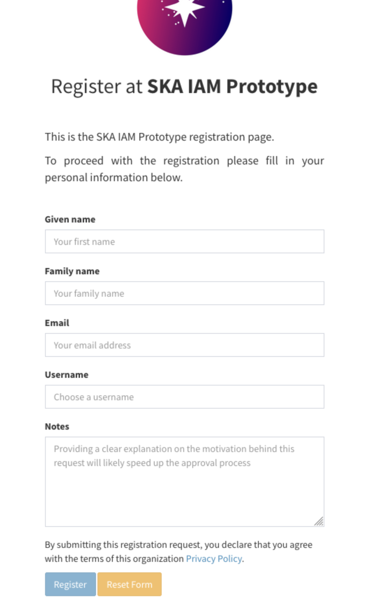

======================
Access the application
======================

An authorised account is required to use the MALTOPUFT application.

Create an account
=================

If you don't have an SKA IAM account, you will need to follow the steps below to create one.

1. Go to `SKA IAM <https://ska-iam.stfc.ac.uk/login>`_ homepage.

   SKA IAM homepage.

2. Click 'Apply for an account' or, if you would like to link your institutional account, 'Sign in with EduGain'.
3. Fill in the form pictured below, making sure to add `maltopuft-api prototype testing` to the notes.

   SKA IAM registration form.

4. Submit the form.

It may take a couple of days for the request to be reviewed and authorised. 

Apply for access
================

As discussed in :ref:`auth-docs`, access to MALTOPUFT is provided based on which security groups an SKA IAM account is a member of.

Members of the following groups are authorised to access MALTOPUFT:

1. `src`
2. `src/maltpuft`
3. `src/maltopuft/user`
4. `services/maltopuft-api`

After logging into SKA IAM, click `Join a group` (circled) and request to join the groups listed above.

   Applying to become an SKA IAM group member.

It may take a couple of days for the request to be reviewed and authorised.
