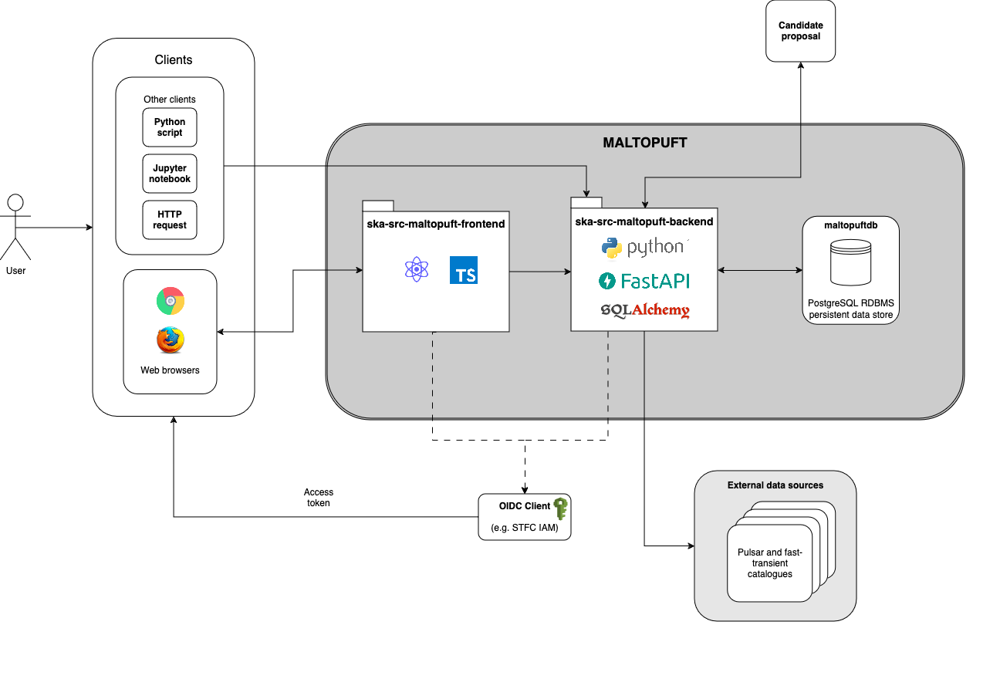

=========
MALTOPUFT
=========

MALTOPUFT is a prototype MAchine Learning TOolkit for PUlsars and Fast Transients. The toolkit will provide a unified interface to:

1. View single pulse and periodic candidates identified by SKA precursors and, once operational, the SKA.
2. Assign "ground-truth" labels to candidates for use in Machine Learning classifier training.
3. Retrieve and create version controlled datasets for use in the Machine Learning classifier training and evaluation pipelines.

MALTOPUFT does this by providing a database server for storing proposed pulsar and fast-transient candidate (meta) data and a `RESTful (REST) API <https://aws.amazon.com/what-is/restful-api/>`_ which allows clients to interact with candidates stored in the database. Furthermore, MALTOPUFT implements a GUI component to interactively view and label candidates with the REST API.

.. tip::

    REST APIs provide a unified interface for clients to interact with resources stored on remote servers (often a database) over a network.

    In general, a client can be any entity that requests resources from the server. Clients often make JSON formatted requests via the HTTP protocol.
    
    REST APIs expose several *paths* or *endpoints* to clients which the server uses to identify the intended resource. HTTP methods (such as `GET`, `POST`, `PUT`, `DELETE`) are used to specify what the server needs to do to the resource.

Components
==========

---------------
Database server
---------------

The MALTOPUFT API primarily requests resources from a database server (``maltopuftdb``). ``maltopuftdb`` is a PostgreSQL Relational DataBase Management System (RDBMS).

-----------------------
MALTOPFUT API (backend)
-----------------------

A REST API built with the `FastAPI <https://fastapi.tiangolo.com/>`_ web framework.

The REST API will be deployed as a web service. This repository holds all code relating to the MALTOPUFT RESTful API web service.

The backend service initialises database connections and handles Create, Read, Update and Delete (CRUD) operations with the `SQLAlchemy <https://www.sqlalchemy.org/>`_. SQLAlchemy is an object-relational mapping (ORM) library which provides a convenient way to express database models and queries in application code. 

--------------------------------------------
Candidate viewer and labeller GUI (frontend)
--------------------------------------------

MALTOPUFT API development is currently focusing on implementing endpoints which will be used by a GUI for viewing and labelling single pulse and periodic candidates. The GUI component will often be referred to as the "frontend". Please refer to `ska-src-maltopuft-frontend <https://gitlab.com/ska-telescope/src/ska-src-maltopuft-frontend>`_ for details about the frontend component.

---------
OIDC Auth
---------

Two core components of "auth" are authentication and authorisation.

Authentication essentially asks the question "*is this person who they say they are?*". If the answer is "*yes*", then authorisation goes on to ask "*is this person authorised to perform the requested operation on the specified resource(s)?*".

In MALTOPUFT, auth will be handled with `SKA IAM <https://ska-iam.stfc.ac.uk/login>`_ Open ID Connect (OIDC) client. Please refer to the `(external) How OIDC works <https://openid.net/developers/how-connect-works/>`_ documentation for an overview.

MALTOPUFT will interact with the IAM client with the `ska-src-auth-api <https://gitlab.com/ska-telescope/src/src-service-apis/ska-src-auth-api/-/tree/main?ref_type=heads>`_. This feature has not been integrated into MALTOPUFT yet, however the documentation will be kept up-to-date with any changes.

Architecture overview
=====================

At a high level, the components outlined in the previous section interact in the following ways:

   MALTOPUFT web service architecture. 

